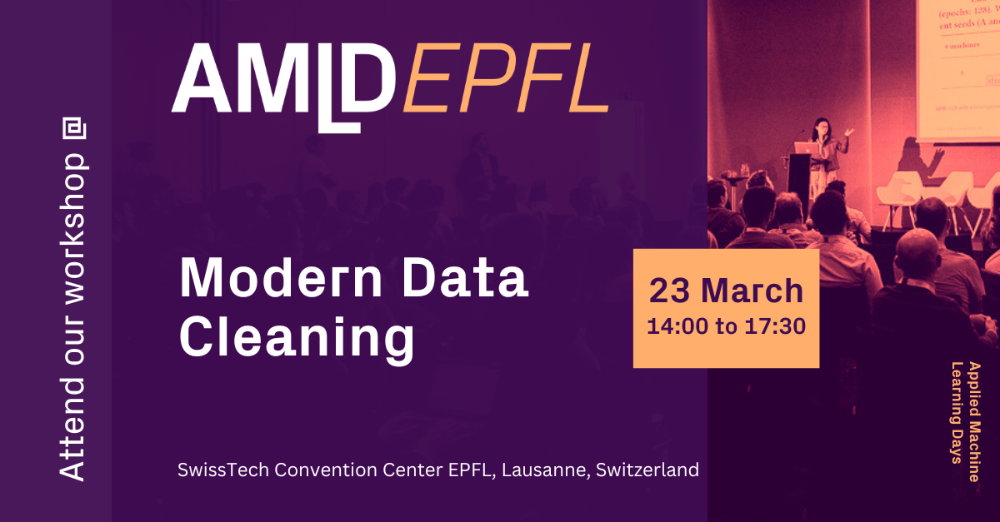

# Summary

Modern data cleaning approaches will be presented, explained, and critically reviewed with a focus on emerging tools for image dataset curation.
Automatic detection of data quality issues in data collections of growing size will be motivated by reviewing contamination in popular benchmarks and by assessing its impact on the training and evaluation of machine learning models.
Data cleaning will be shown to be complementary to learning with noise, although it is not quite as known.
Particular attention will be paid to near-duplicate images, which can lead to train-evaluation data leaks, irrelevant samples, which are invalid within their context, and label errors, which corrupt the learning signal.
The major repositories containing resources for data cleaning will be presented with their strengths and weaknesses, used in guided examples, and participants will be encouraged to clean their own datasets in the closing part of the tutorial.

# Agenda

- 14:00 -- 14:45 Phenomenology of data quality issues
- 14:45 -- 15:30 Modern data cleaning methods
- *15:30 -- 16:00 Coffee break*
- 16:00 -- 16:30 Modern data cleaning libraries
- 16:30 -- 17:15 Hands-on session: clean your own image dataset
- 17:15 -- 17:30 Discussion based on findings and wrap-up

# Speakers

| Simone Lionetti | Fabian Gröger |
|:--:|:--:|
|  |  |
| Algorithmic Business Research Lab Department of Informatics Lucerne University of Applied Sciences and Arts | Digital Dermatology Group Department of Biomedical Engineering University of Basel |

# Links

- [AMLD EPFL 2024 Website](https://2024.appliedmldays.org)
- [Tickets](https://ti.to/applied-machine-learning-days/2024)

# Format

Our workshop will consist of short theoretical explanations, critical discussions of pros and cons, presentations of tools, and guided and independent coding sessions.
Participants not only have the chance to ask for explanations, but also to bring in their own experience, contributions and opinions which will be abundant on such an ubiquitous topic.
Moreover, attendants can follow illustrative, stimulating examples and apply what they have learned to an own problem.

# Objectives

Participants will get to know the working principles of modern data cleaning strategies, the different sub-problems they address and their impact on machine learning models.
They will learn which packages are available to automate the curation of datasets, including their functionalities, the computational resources required, and their scalability.
At the end of the session, attendants will have gained a set of tools to examine and improve essentially any dataset they will encounter.

# Audience

Given that the topic of data quality is almost ubiquitous and often neglected, our audience includes any user of data-driven methods and/or anyone with the goal of collecting a good dataset.
This can range from students at the end of their bachelor to established researchers and experienced consultants, mostly in computer science but also biology, engineering, medicine, and so on.
Thanks to the mix of basic and advanced topics, most people will have something new and interesting to take home.

# Preparation

A UNIX-like command line terminal is needed, as found natively on Linux and OS X or available on Windows via e.g. WSL.
Have your favourite small- to medium-size image dataset, best if coming from the real world and therefore not perfectly clean, downloaded and ready to try improving it yourself at the end of the session.

--

Expect updates until the tutorial date March 23rd, 2024!

--
